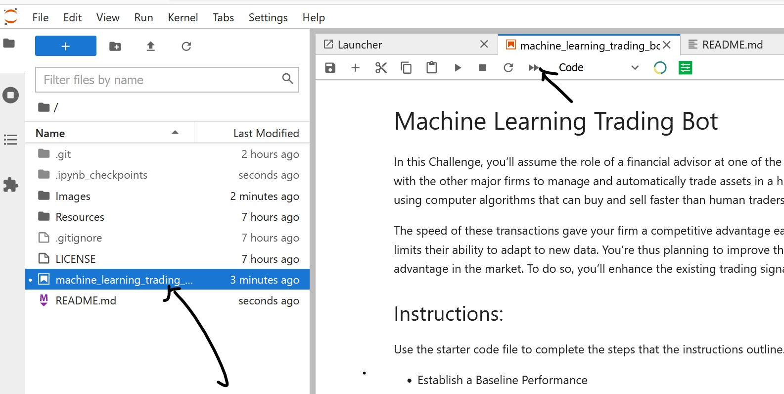
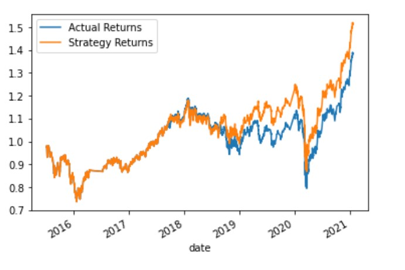
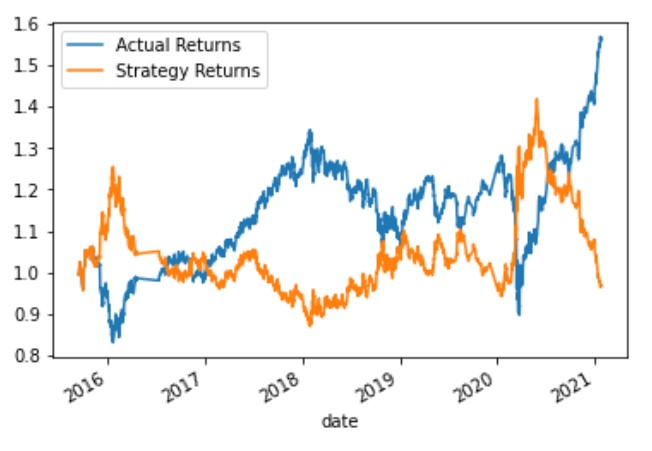
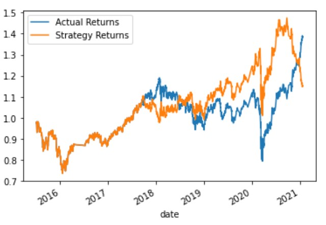
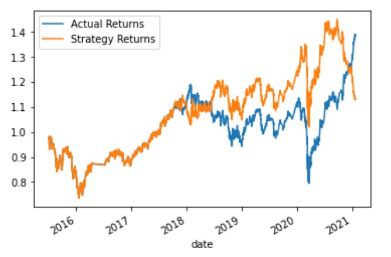
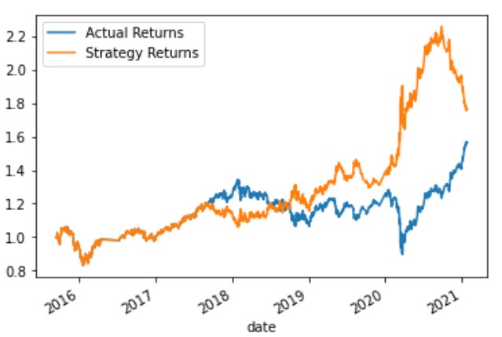

# machine_learning_trading_bot
This is a python-jupyter notebook integrated development environment(IDE) based an algorithmic trading bot that learns and adapts to new data and evolving markets.The notebook works as per the standard phases of finacial analysis by extracting data from CSV, preparation of datasets by cleaning the data and finally analyzing the data through quantitative analysis and visualizations. We use Python and the skllearn libraries/modules for the various steps involved from data preparation to visualization over Jupyter Notebook while applying basics of Machine Learning Concepts to achive the following:
    - Implement an algorithmic trading strategy that uses machine learning to automate the trade decisions.
    - Adjust the input parameters to optimize the trading algorithm.
    - Train a new machine learning model and compare its performance to that of a baseline model

## Technologies

This project leverages python 3.7 with the following packages:

* [Jupyter Lab](https://jupyterlab.readthedocs.io/en/stable/#) - Is a browser-based interface to work with documents and activities such as Jupyter notebooks, text editors, terminals, and custom components in a flexible, integrated, and extensible manner.

* [scikit-learn](https://scikit-learn.org/stable/getting_started.html) - Scikit-learn is an open source machine learning library that supports supervised and unsupervised learning. [scikit-learn user_guide](https://scikit-learn.org/stable/user_guide.html) 


Note:
* [hvplot](https://hvplot.holoviz.org/user_guide/Introduction.html) - hvplot makes interactive visualization available through Jypyter Notebook and Voilà. 

---

## Installation Guide

You will need Python version 3.7 or above and gitbash/terminal on your computer, along with other supporting packages as mentioned below. 

Please follow instructions from the below link to install python 3.7 or above on your computer

[To install Python, follow instructions from this link](https://www.python.org/downloads/)

[To install Git Bash, follow instructions from this link](https://github.com/git-guides/install-git)

[To install hvplot, follow instructions from this link](https://holoviz.org/tutorial/Setup.html)

[To install scikit-learn, follow instructions from this link](https://scikit-learn.org/stable/install.html#installation-instructions)


To access the Jupiter notebook, first install the following dependencies.

 [Anaconda](https://docs.anaconda.com/anaconda/install/)

```python
# install conda dev environment and activate it
    conda update conda
    conda create -n dev python=3.7 anaconda
    conda activate dev
# install Jupyter Lab
    pip install jupyterlab

# To verify if you have scikit-learn and hvplot already installed
    conda list scikit-learn
    conda list hvplot
  
# Optional:    
# install scikit-learn
    pip install -U scikit-learn

# install hvPlot
    conda install -c pyviz hvplot

```


---


## Usage

To use the Jupyter Notebook, clone the repository and do not forget to run the above commands as applicable,

```git
git clone https://github.com/sidbetatester/machine_learning_trading_bot.git

```
Upon launching the Jypyter notebook, you will notice an interface similar to the one below, click  on the 'machine_learning_trading_bot.ipynb' file and you will have the complete analysis. 



Note:
* You can shut down the notebook from the File menu when you are done using the report.


---

## Evaluation Report

### Establish a Baseline Performance

    > Conclusions about the performance of the baseline trading algorithm
    
    - Baseline Training Window: 4 and 100
                  precision    recall  f1-score   support

        -1.0       0.43      0.04      0.07      1804
         1.0       0.56      0.96      0.71      2288

    accuracy                           0.55      4092
    macro avg       0.49     0.50      0.39      4092
    weighted avg    0.50     0.55      0.43      4092

   
    
    - The baseline trading algorithm performed pretty well through out the period. While it matched the actual returns very well from the beginning of the period until mid in 2018, it predicts higher than the actual performance towards the recent years. The precision and recall values show that the model is better at predicting 1 class than the -1 class for the baseline parameters.


### Tune the Baseline Trading Algorithm
    > What impact resulted from increasing or decreasing the training window?
    
    - Decreasing the Training Window: 20 and 100
                  precision    recall  f1-score   support

        -1.0       0.00      0.00      0.00      1804
         1.0       0.56      1.00      0.72      2288

    accuracy                           0.56      4092
    macro avg      0.28      0.50      0.36      4092
    weighted avg   0.31      0.56      0.40      4092


    
    - While the plot shows there is very high match between the actual and the model, the precision and recall values show it only capable of predicting '1' class and not the '-1' class.

    Increasting the Training Window: 4 and 200
                 precision    recall  f1-score   support

        -1.0       0.44      0.85      0.58      1740
         1.0       0.58      0.16      0.25      2227

    accuracy                           0.47      3967
    macro avg      0.51      0.51      0.42      3967
    weighted avg   0.52      0.47      0.40      3967


    
    - From the plot, it is evident that as we increase the window, the model is behaving exactly opposite to the actual performance, this is the worst case and is also evident from the precision and recall values, the precision is better for '1' class and while recall is favoring '-1' class.


### Evaluate a New Machine Learning Classifier
    > Did this new model perform better or worse than the provided baseline model? Did this new model perform better or worse than your tuned trading algorithm?
    - LogisticRegression model has improved the prediction over the svc model. This is evident from all three senarios we have tested as shown below
    
    Base Parameters:
                 precision    recall  f1-score   support

        -1.0       0.44      0.33      0.38      1804
         1.0       0.56      0.66      0.61      2288

    accuracy                           0.52      4092
    macro avg      0.50      0.50      0.49      4092
    weighted avg   0.51      0.52      0.51      4092


    
    Decreasing the Training Window: 20 and 100
                 precision    recall  f1-score   support

        -1.0       0.44      0.26      0.33      1804
         1.0       0.56      0.73      0.63      2288

    accuracy                           0.53      4092
    macro avg      0.50      0.50      0.48      4092
    weighted avg   0.51      0.53      0.50      4092




    Increasting the Training Window: 4 and 200
                 precision    recall  f1-score   support

        -1.0       0.45      0.45      0.45      1740
         1.0       0.57      0.57      0.57      2227

    accuracy                           0.52      3967
    macro avg      0.51      0.51      0.51      3967
    weighted avg   0.52      0.52      0.52      3967




---

## Contributors

Siddharth Venkumahanti
[linkedin](https://www.linkedin.com/in/siddharthvenkumahanti/)


---


## License

### MIT License

Copyright (c) [2022] [Siddharth Venkumahanti]

Permission is hereby granted, free of charge, to any person obtaining a copy
of this software and associated documentation files (the "Software"), to deal
in the Software without restriction, including without limitation the rights
to use, copy, modify, merge, publish, distribute, sublicense, and/or sell
copies of the Software, and to permit persons to whom the Software is
furnished to do so, subject to the following conditions:

The above copyright notice and this permission notice shall be included in all
copies or substantial portions of the Software.

THE SOFTWARE IS PROVIDED "AS IS", WITHOUT WARRANTY OF ANY KIND, EXPRESS OR
IMPLIED, INCLUDING BUT NOT LIMITED TO THE WARRANTIES OF MERCHANTABILITY,
FITNESS FOR A PARTICULAR PURPOSE AND NONINFRINGEMENT. IN NO EVENT SHALL THE
AUTHORS OR COPYRIGHT HOLDERS BE LIABLE FOR ANY CLAIM, DAMAGES OR OTHER
LIABILITY, WHETHER IN AN ACTION OF CONTRACT, TORT OR OTHERWISE, ARISING FROM,
OUT OF OR IN CONNECTION WITH THE SOFTWARE OR THE USE OR OTHER DEALINGS IN THE
SOFTWARE.


